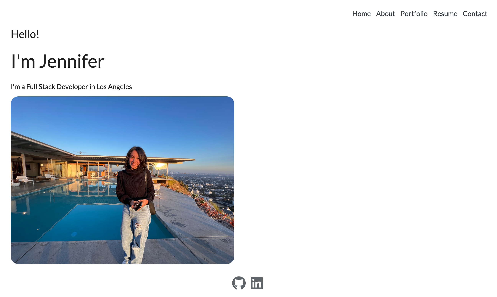
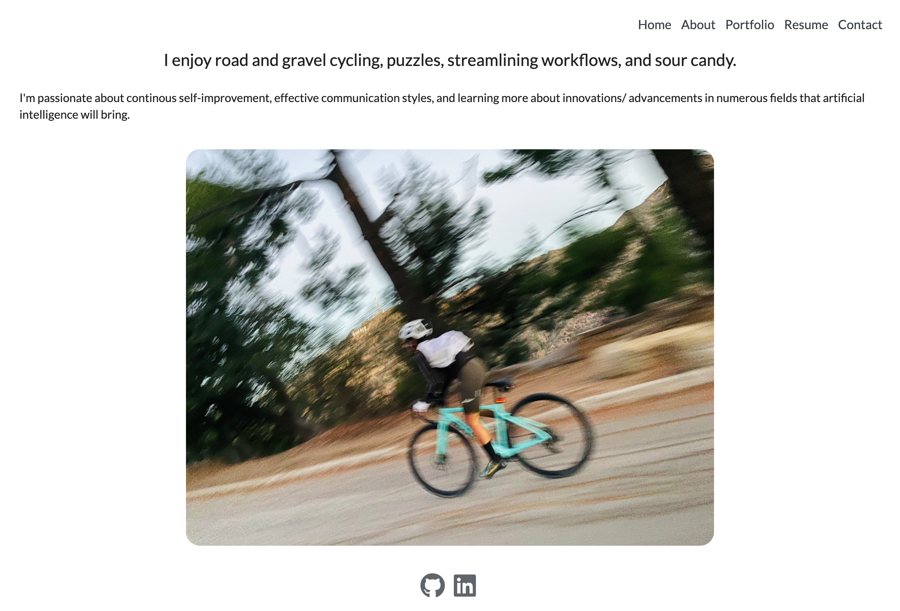
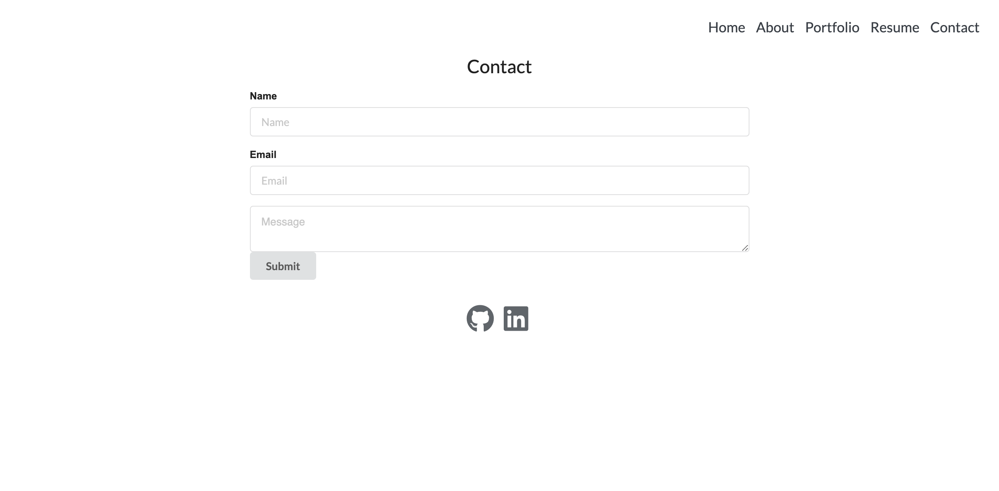
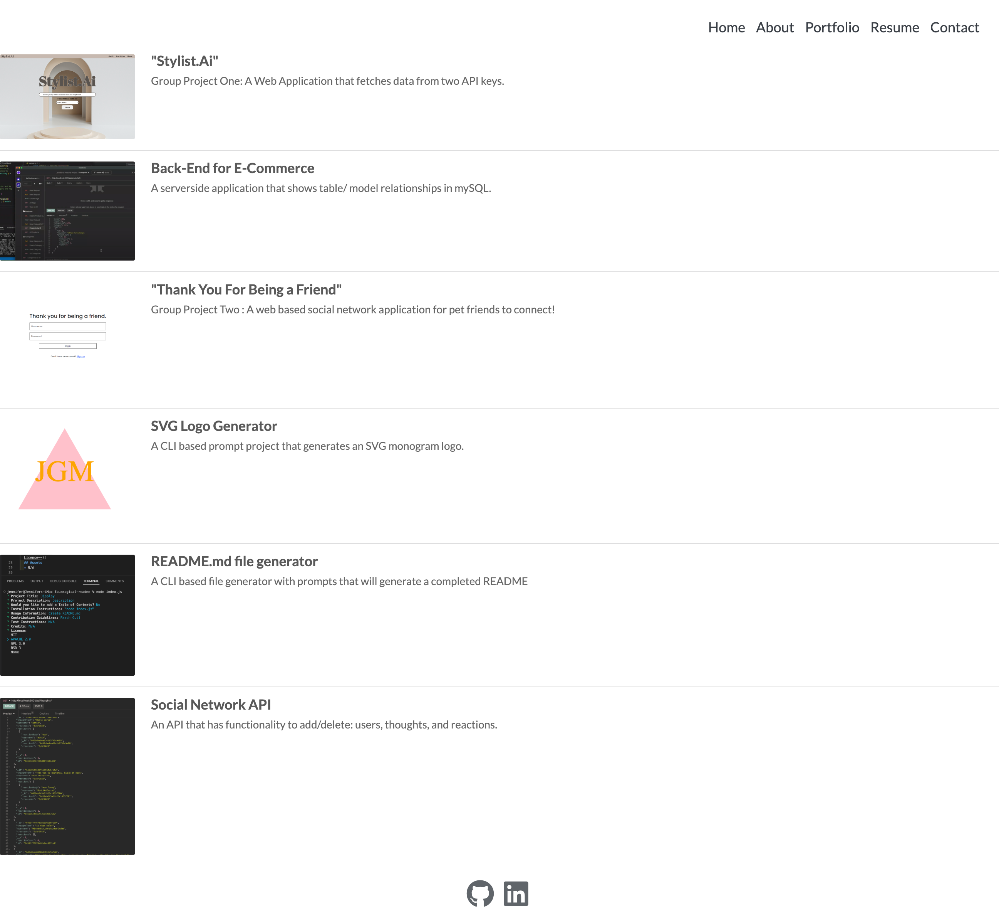

# jgm-reactfolio
a portfolio made with React, showcasing projects I've worked on thus far in UCLA's Full-Stack Web Development Program

## Usage

A portfolio that will be used to hold projects, a contact form, a resume, and links to [Github, LinkedIn, and soforth] to use when sending to potential employers.

## Description

## Installation
1. node v 
         [if already installed will show current version]
2. npx install react-create-app . 
                *given that the repository was created beforehand [otherwise,  'npx install react-create-app-<app-name-here>]
3.  npm install react-router-dom
                * this was an extra addition. it was not a requirement Acceptance Criteria's MVP
4. Semantic UI
5. Express.JS
                to have routes available for deployment

## License

MIT License

## Acknowledgements & Resources
[Color Palette](https://colorhunt.co/palette/f7f7f7eeeeee393e46929aab)

[Coolors Color Palette](https://coolors.co/palette/aaaaaa-bbbbbb-cccccc-dddddd-eeeeee)

[Linebreaks with Text rendering in JSX files](https://dev.to/cassidoo/make-line-breaks-work-when-you-render-text-in-a-react-or-vue-component-4m0n)

## Deployment

## Status

As the program ends, this will serve as a starter portfolio which I will continue to build on. The projects will be changed accordingly as well as adding more dynamic features.

## Assets/ Images

